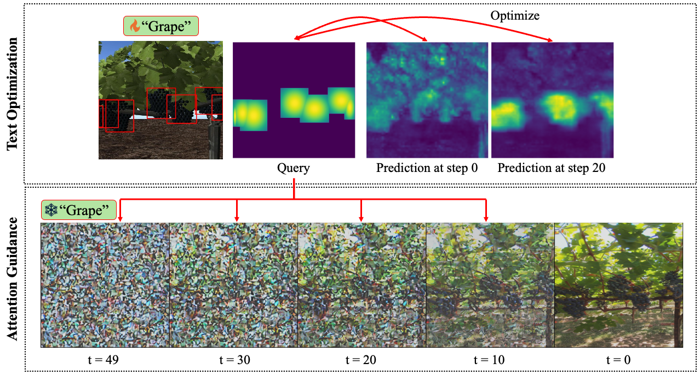

# AGILE
**A**ttention-**G**uided **I**mage and **L**abel Translation for **E**fficient Cross-Domain Plant Trait Identification


<a href="https://arxiv.org/abs/2503.22019"></a>
<a href="https://huggingface.co/papers/2503.22019"></a>

## 1. Prepare pretrained weights

Go to official ControlNet repository to obtain pretrained ControlNet weights: https://github.com/lllyasviel/ControlNet/blob/main/docs/train.md

Save your checkpoint here: `checkpoints/`

## 2. Create a new conda environment

```
conda env create -n agile python=3.10
pip install -r requirements.txt
```

## 3. Setup example dataset and checkpoints

You can download the dataset from [AgML](https://github.com/Project-AgML/AgML).

Here are the recommended datasets to get started:
- Synthetic: `grape_detection_syntheticday`
- Real: `grape_detection_californiaday`

To download and setup this dataset, use the notebook in `setup/install_dataset.ipynb`

## 3. Run text optimization

To run text optimization, run this bash script: `scripts/run_optimize.sh`

Feel free to edit any script inputs if you are using a custom dataset.

## 4. Run attention guidance

Take the path of your optimized prompt embeddings from Step 3 from your logs directory in `text_optimizer/optimized_embeddings.pt` and input it in `PROMPT_EMBEDDING` within the script: `scripts/run_control.sh`.

Run image generation with attention guidance with: `scripts/run_control.sh`

## 5. Using custom checkpoints

To skip model fine-tuning within Step 3 and Step 4, add the `--subset` flag in each python call and change the `CHECKPOINT` input to point at the custom checkpoints.
